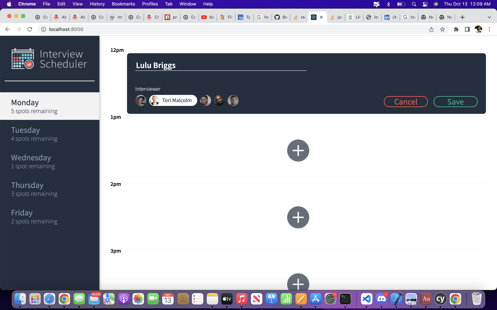
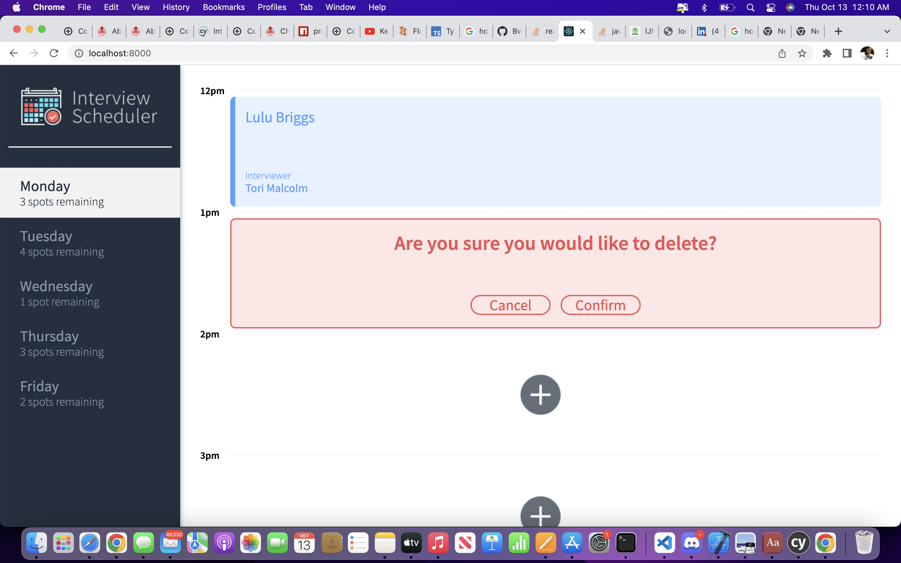
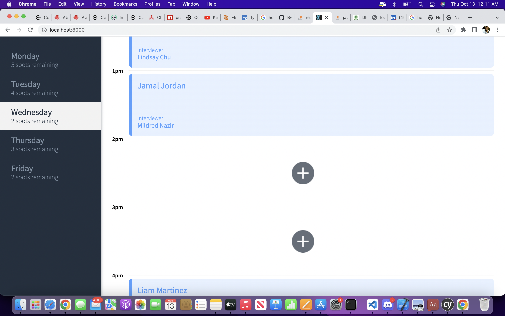
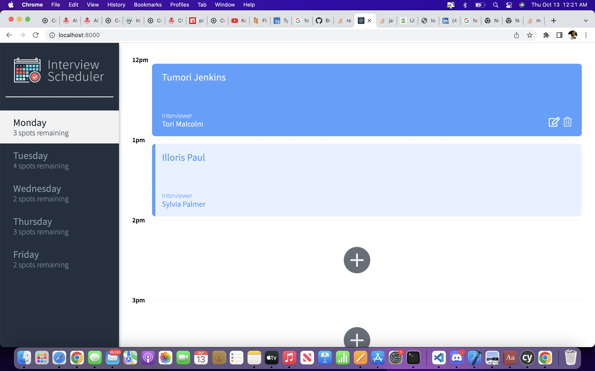
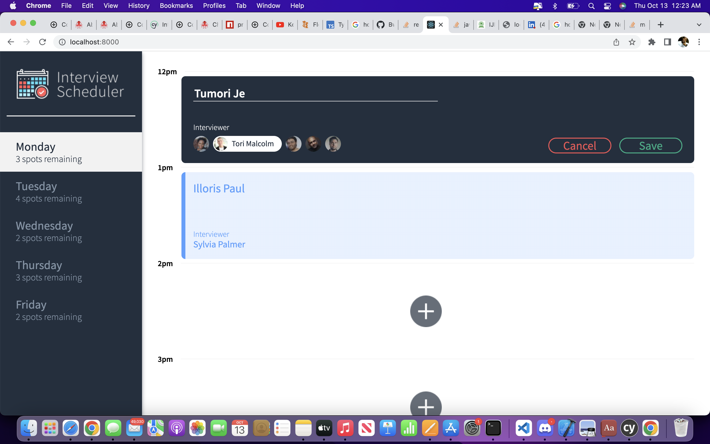

# Interview Scheduler

## Interviewer Scheduler is a web application built on react. 
## Features
  - A User can Create an Appointment
  - Edit an Appointment
  - Cancel an Appointment
  - Check the number of spots remaining per day
## Test Frameworks
  - jest [unit and integration testing]
  - cypress [end to end testing]
  - storybook [component testing]
## Other Frameworks
  - Sass [cascading styles sheet]
  - express [ server ]
  - JSX

## Screenshots








## Setup

Install dependencies with `npm install`.

## Running Webpack Development Server

```sh
npm start
```

## Running Jest Test Framework

```sh
npm test
```

## Running Storybook Visual Testbed

```sh
npm run storybook
```
